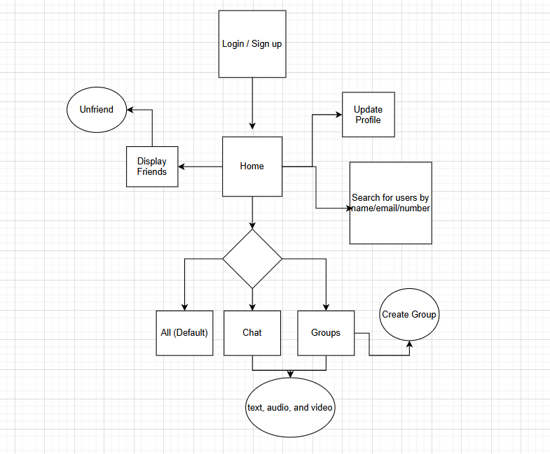

# Webline ui

## 🌐 Angular Frontend

The **Webline Frontend** is a Single Page Application (SPA) built with **Angular**, providing a responsive and user-friendly interface for the [chat application]
### 🔹 Features

- User authentication (login/register)
- Real-time messaging using WebSockets
- User profile management

### 🔌 Communication

- Connects to backend services via **HTTP** and **WebSockets**

### 🚀 Development

- Built with [Angular CLI](https://angular.io/cli)
- Run locally using:

  ```bash
  npm start
  ```

## Flow Diagram


